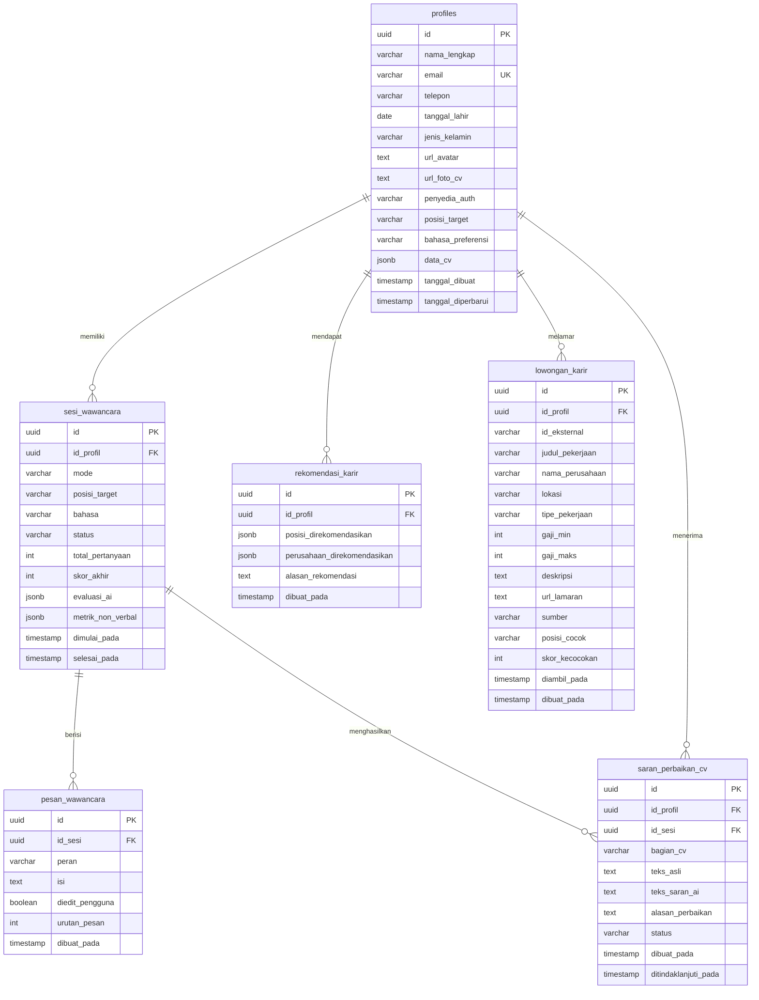
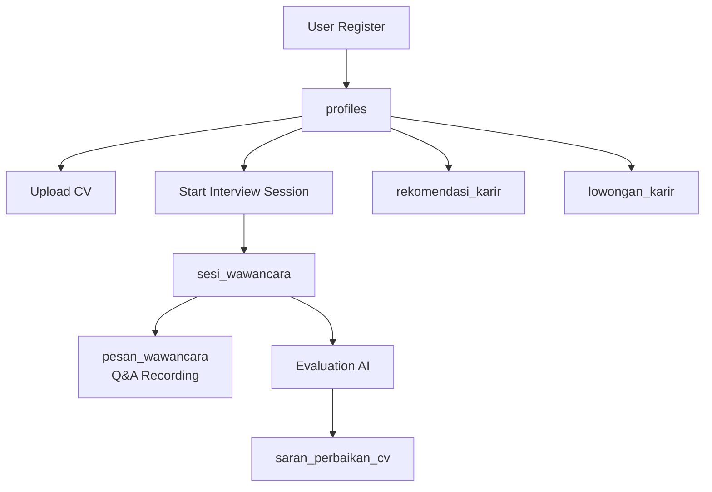

# IntervU AI - Database Schema Overview

## Entity Relationship Diagram (ERD)

## Tabel & Deskripsi

| Tabel | Deskripsi | Relasi |
|-------|-----------|--------|
| **profiles** | Data pengguna/pelamar kerja | Parent table, terhubung ke auth.users |
| **sesi_wawancara** | Sesi wawancara AI dengan kandidat | Child dari profiles, parent dari pesan_wawancara |
| **pesan_wawancara** | Transkrip percakapan wawancara | Child dari sesi_wawancara |
| **rekomendasi_karir** | Rekomendasi karir dari AI | Child dari profiles |
| **lowongan_karir** | Daftar lowongan pekerjaan | Child dari profiles |
| **saran_perbaikan_cv** | Saran perbaikan CV dari AI | Child dari profiles & sesi_wawancara |

## Flow Diagram

## Enum Values

### `profiles.jenis_kelamin`
- `pria`
- `wanita`
- `prefer_tidak_menyebutkan`

### `profiles.penyedia_auth`
- `google`
- `email`

### `profiles.bahasa_preferensi`
- `id` (Indonesia)
- `en` (English)

### `sesi_wawancara.mode`
- `teks`
- `audio`
- `video`

### `sesi_wawancara.bahasa`
- `id`
- `en`

### `sesi_wawancara.status`
- `berlangsung`
- `selesai`
- `ditinggalkan`

### `pesan_wawancara.peran`
- `pewawancara`
- `kandidat`

### `saran_perbaikan_cv.status`
- `menunggu`
- `diterima`
- `ditolak`
- `diedit_dan_diterima`

### `lowongan_karir.sumber`
- `jsearch` (default)
- _lainnya_

## Key Metrics

- **skor_akhir**: 0-100 (nilai wawancara)
- **skor_kecocokan**: 0-100 (kecocokan lowongan dengan profil)

---
*Generated for IntervU AI Database Documentation*
